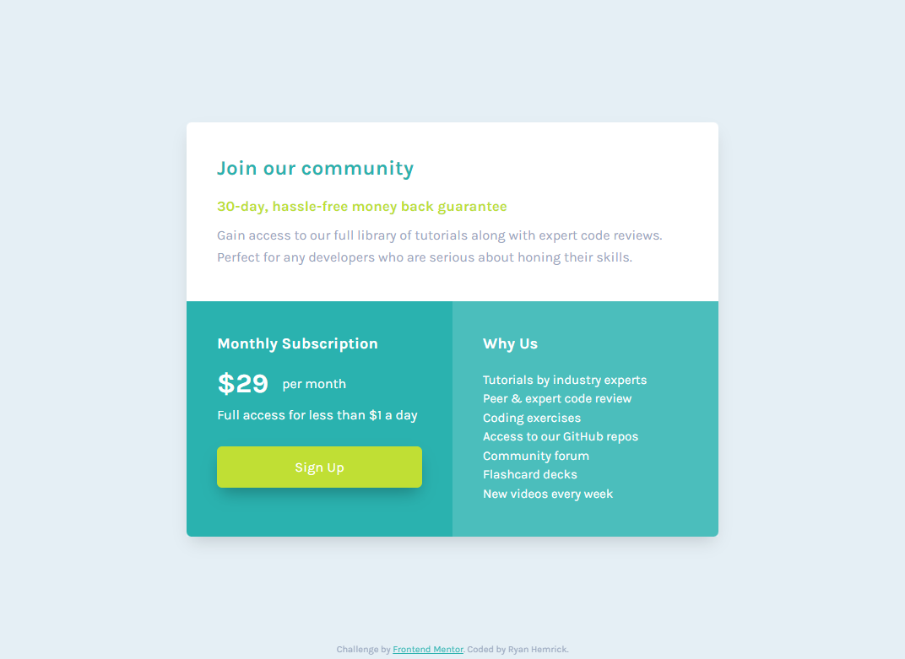

# Frontend Mentor - Single price grid component solution

This is a solution to the [Single price grid component challenge on Frontend Mentor](https://www.frontendmentor.io/challenges/single-price-grid-component-5ce41129d0ff452fec5abbbc). Frontend Mentor challenges help you improve your coding skills by building realistic projects. 

## Table of contents

- [Overview](#overview)
  - [The challenge](#the-challenge)
  - [Screenshot](#screenshot)
  - [Links](#links)
- [My process](#my-process)
  - [Built with](#built-with)
  - [What I learned](#what-i-learned)
- [Author](#author)

## Overview
- A responsive 'single price grid component' built with HTML and CSS (CSS Grid)

### The challenge
- Build out this grid-component and get it looking as close to the design as possible.

### Screenshot

### Links
- Live Site URL: https://superlative-mooncake-c15950.netlify.app

## My process
- Utilized CSS Grid on the **body** element to vertically and horizontally center the *grid-wrapper* element
- Used a mobile-first approach to writing CSS
- Utilized CSS Grid properties on the *grid-wrapper* element to get the desired layout
- Utilized a media query to adjust the grid layout for larger screen sizes
- Created an alternate CSS file that utilizes **grid-template-areas**

### Built with
- Semantic HTML5 markup
- CSS custom properties
- CSS Grid
- CSS Flexbox

### What I learned
- How to work with CSS Grid for basic layouts
- Continued practice with writing mobile-first CSS
- How to achieve the desired layout with different CSS grid properties
- Gained valuable practice writing minimal CSS code to properly match sizing and spacing changes on different device sizes

## Author
- Ryan Hemrick